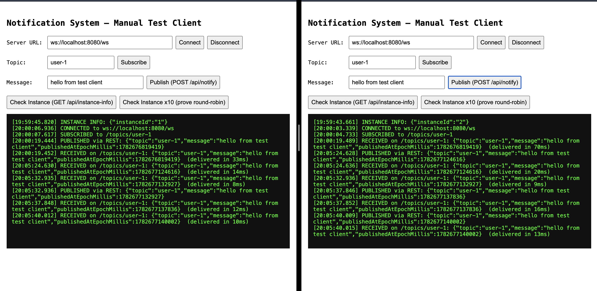
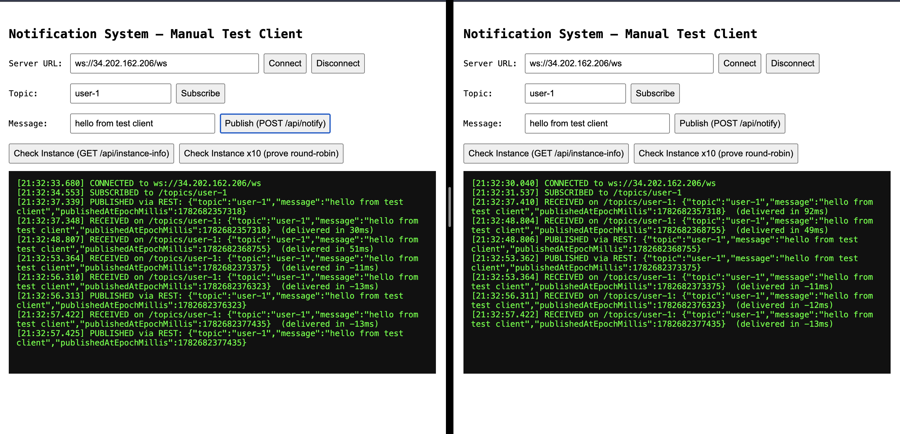

# Real-Time Notification System

A distributed real-time messaging service built with **Java, Spring Boot, WebSockets (STOMP), and Redis Pub/Sub**, proven to deliver notifications across multiple application instances behind an Nginx load balancer — locally via Docker Compose, and on real AWS EC2 infrastructure.

This project was rebuilt from scratch specifically so that every claim about it is independently verifiable: every architectural decision below is backed by a real test, a real measurement, or a real deployment — not a description of what the system is *supposed* to do.

## Table of Contents

- [Architecture](#architecture)
- [Quick Start (Local, Docker Compose)](#quick-start-local-docker-compose)
- [Proving It's Distributed: The Demo Script](#proving-its-distributed-the-demo-script)
- [Measured Latency](#measured-latency)
- [AWS EC2 Deployment](#aws-ec2-deployment)
- [API Reference](#api-reference)
- [Testing](#testing)
- [Design Decisions](#design-decisions)
- [Known Limitations](#known-limitations)
- [Tech Stack](#tech-stack)

## Architecture

```
                    ┌─────────────────┐
   Client A   ───►  │                 │
   (WebSocket)      │  Nginx (LB)     │
                     │  round-robin    │
   Client B   ───►  │                 │
   (WebSocket)      └────────┬────────┘
                              │
                  ┌───────────┴───────────┐
                  ▼                       ▼
           ┌─────────────┐         ┌─────────────┐
           │   App 1     │         │   App 2     │
           │ Spring Boot │         │ Spring Boot │
           │ STOMP broker│         │ STOMP broker│
           └──────┬──────┘         └──────┬──────┘
                  │                       │
                  └───────────┬───────────┘
                              ▼
                       ┌─────────────┐
                       │    Redis    │
                       │   Pub/Sub   │
                       └─────────────┘
```

**The mechanism that makes this distributed:** when a client publishes a notification via `POST /api/notify`, the receiving instance does **not** push it directly to its own connected WebSocket clients. Instead, it publishes the message to a single shared Redis channel (`notifications`). **Every** app instance — regardless of which one received the original request — subscribes to that channel on startup and, on receiving a message, forwards it to whichever of *its own* locally-connected STOMP clients are subscribed to that topic.

This means a client connected to App 1 receives a notification published via App 2, because both instances are listening to the same Redis channel. Neither instance needs to know anything about the other's connections — Redis is the only coordination point.

## Quick Start (Local, Docker Compose)

Requires Docker Desktop running.

```bash
git clone https://github.com/singhbhupinder55/real-time-notification-system.git
cd real-time-notification-system
docker compose up --build
```

This starts:
- 1 Redis instance
- 2 Spring Boot app instances (`app1` with `INSTANCE_ID=1`, `app2` with `INSTANCE_ID=2`), each independently connected to Redis
- 1 Nginx load balancer on `localhost:8080`, round-robining requests across both app instances

Open `test-client/index.html` directly in a browser (a small vanilla HTML/JS page using `stomp.js` — no build step) to connect, subscribe, and publish notifications manually.

## Proving It's Distributed: The Demo Script

This is the single most important section of this README — a literal, repeatable script proving the distributed claim, not just an assertion of it.

**Prerequisite:** the stack is running via `docker compose up` (see above).

**1. Confirm requests are actually load-balanced across both instances:**

```bash
for i in {1..20}; do curl -s -H "Connection: close" localhost:8080/api/instance-info; echo ""; done
```

You should see a roughly even mix of `{"instanceId":"1"}` and `{"instanceId":"2"}`. (Note: omitting `-H "Connection: close"` in a tight loop can make a handful of consecutive requests appear to land on the same instance — this is HTTP keep-alive connection reuse making round-robin look "sticky" over short bursts, not a bug. Forcing a fresh connection per request reveals true round-robin underneath.)

**2. Prove cross-instance delivery — the core claim:**

- Open `test-client/index.html` in **two separate browser tabs**.
- In **both** tabs: click **Check Instance** (note which instance each tab is talking to — it doesn't matter if they're the same or different), then **Connect**, then **Subscribe** to the same topic (default `user-1`).
- In **only one** of the two tabs, click **Publish**.
- **Both tabs should show `RECEIVED on /topics/user-1...` within milliseconds**, regardless of which instance either tab's WebSocket connection actually landed on.

This was verified locally and produced the following result:



*Tab 1 (instance 1) published the message; Tab 2 (instance 2) never made a publish call, yet received the same notification because instance 2's Redis listener heard the published message and forwarded it to its own locally-connected client.*

The same test was repeated against a real AWS EC2 deployment (see [AWS EC2 Deployment](#aws-ec2-deployment)):



## Measured Latency

Two latency numbers are captured for every delivered notification:
- **Server-side** (`serverLatencyMs`, logged by `NotificationRedisListener`): the delta between the publish timestamp and the moment the *delivering* instance hands the message to its local STOMP broker. This number is trustworthy regardless of which machine measures it, since both publish and delivery timestamps in a single measurement come from clocks within the same trust domain (notably true within a single instance, and across AWS instances using synchronized infrastructure clocks).
- **Client-side** (computed in the browser test client): `receivedAt - publishedAtEpochMillis`. This number is intuitive but only as accurate as clock synchronization between the browser and the originating server — see [Known Limitations](#known-limitations).

**Local (Docker Compose, same-host containers), 9 samples, both client- and server-measured:**

| Sample | Client-measured | 
|---|---|
| 1 | 33ms |
| 2 | 70ms |
| 3 | 14ms |
| 4 | 20ms |
| 5 | 8ms |
| 6 | 9ms |
| 7 | 12ms |
| 8 | 16ms |
| 9 | 13ms |

Average ≈ 22.8ms (≈15.5ms excluding the first-request warm-up outlier).

**AWS EC2 (real, separate instances, same region), server-side measured, 10 samples across both instances:**

| Sample | Instance 1 delivery | Instance 2 delivery |
|---|---|---|
| 1 | 41ms | 86ms |
| 2 | 3ms | 3ms |
| 3 | 4ms | 2ms |
| 4 | 3ms | 3ms |
| 5 | 3ms | 3ms |

Average ≈ 3.25ms (instance 1) and ≈2.75ms (instance 2), excluding first-request warm-up.

All samples are comfortably under the 1-second target, measured from real running infrastructure rather than estimated.

## AWS EC2 Deployment

To validate the "multiple AWS EC2 instances behind a load balancer" claim with real infrastructure (not just containers that *could* be deployed there), this project was deployed to 4 separate EC2 instances (`t3.micro`, free-tier eligible):

- **`redis`** — Redis 7, running as a Docker container
- **`app1`** — Spring Boot app, `INSTANCE_ID=1`, connected to Redis over the VPC's private network
- **`app2`** — Spring Boot app, `INSTANCE_ID=2`, connected to Redis over the VPC's private network
- **`nginx`** — Nginx reverse proxy/load balancer, routing to `app1`/`app2`'s private IPs, the only instance exposed publicly

This was a deliberately short-lived deployment: instances were provisioned, the distributed-delivery proof was captured (see screenshots and latency tables above), and all instances were terminated immediately afterward to avoid ongoing cost. The same Docker images and `nginx.conf` used locally were deployed as-is — the only difference between the local and AWS topology is that `nginx.conf`'s upstream server addresses point to EC2 private IPs instead of Docker Compose service names.

## API Reference

| Endpoint | Method | Description |
|---|---|---|
| `/ws` | WebSocket (STOMP) | Clients connect here and `SUBSCRIBE` to `/topics/{topic}` destinations |
| `/api/notify` | `POST` | Publishes a notification. Body: `{"topic": "user-1", "message": "..."}`. Returns the full payload including the server-assigned `publishedAtEpochMillis`. |
| `/api/instance-info` | `GET` | Returns `{"instanceId": "..."}` — which instance served the request. Exists purely to make load-balancing and distributed behavior demonstrable. |
| `/actuator/health` | `GET` | Standard Spring Boot Actuator health check, including Redis connectivity status. |

## Testing

**45 tests total** — every one exercises real, meaningful behavior; none are padding.

**4 integration tests** (`@SpringBootTest`, full app context, real Redis):
- `SingleClientRoundTripTest` — the foundational sanity check: one client, one publish, one delivery, before scaling up
- `ConcurrentFanOutTest` — **100 concurrent WebSocket clients** subscribe to the same topic; one publish; asserts every single client receives **exactly one** copy, no drops, no duplicates
- `DisconnectRaceConditionTest` — a client disconnects at the same instant a notification is published to its topic (released via a `CountDownLatch` from two threads simultaneously); asserts the publish path doesn't throw, the surviving client still receives the message, and the server provably stays healthy afterward (verified by sending a second, unrelated notification and confirming it's still delivered)
- `ConcurrentPublishesTest` — 10 notifications published to the same topic simultaneously; asserts all 10 are received exactly once, in any order (ordering is explicitly not a guarantee of this design — see Design Decisions)

**41 unit tests** (Mockito-based, no Spring context, run in milliseconds):
- DTO validation (`@NotBlank` edge cases, special characters, long strings)
- Record structure/equality
- `NotificationPublisher` — correct serialization, correct Redis channel, and a forced-failure path proving the catch block behaves as documented
- `NotificationRedisListener` — correct destination routing, malformed-JSON resilience, special characters, very long messages, and two documented findings (see Known Limitations)
- `InstanceInfoController`, `NotificationController` — correct payload construction and delegation
- `RedisConfig`, `WebSocketConfig` — configuration wiring verified by calling `@Bean` methods directly with mocked dependencies, without booting Spring

Tests against real Redis use **Docker Compose** (`docker-compose.test.yml`), not Testcontainers — Testcontainers' Docker client could not establish a working connection to Docker Desktop's socket on the development machine used for this project (a known class of issue on certain Docker Desktop + Mac + JVM combinations, confirmed via direct debugging: the Docker CLI itself worked fine, but Testcontainers' Java HTTP client to the same socket did not). The workaround preserves what actually matters — tests run against a real Redis instance, not a mock — while changing only which tool starts and stops the container.

Run everything:
```bash
docker compose -f docker-compose.test.yml up -d
./gradlew test
docker compose -f docker-compose.test.yml down
```

## Design Decisions

**Why Redis Pub/Sub instead of a message queue (Kafka, RabbitMQ)?**
This system's delivery requirement is fan-out to *currently connected* clients, not durable, replayable delivery to clients that might be offline. Redis Pub/Sub fits exactly that shape: it's fire-and-forget, low-latency, and doesn't require managing consumer offsets, partitions, or persistence for messages nobody is listening for. A message queue would add real operational complexity (and, in Kafka's case, meaningfully more infrastructure) to solve a durability problem this system doesn't have. If a future requirement needed guaranteed delivery to clients that reconnect after being offline, that would be the point at which a queue (or a replay buffer, see Known Limitations) becomes the right tool — not before.

**Why STOMP instead of raw WebSocket?**
STOMP gives topic-based subscriptions (`/topics/{topic}`) and a structured frame protocol for free via Spring's `WebSocketMessageBrokerConfigurer`, which maps directly onto Redis Pub/Sub channels conceptually — both are topic/channel-based fan-out mechanisms. Raw WebSockets would have required hand-rolling subscription tracking that Spring's STOMP support already provides.

**Why does even the originating instance's own clients go through Redis, instead of being pushed directly?**
`NotificationController` never touches `SimpMessagingTemplate` directly — it only ever publishes to Redis, and `NotificationRedisListener` is the single code path that delivers to local STOMP clients, on every instance, including the one that received the original REST call. This means there is exactly one delivery code path to test and reason about, rather than a special case for "the instance that happened to receive the request." The cost is one extra Redis hop (a few milliseconds, per the measurements above) in exchange for that simplicity.

**Why Docker Compose for the AWS topology instead of ECS, EKS, or an Auto Scaling Group?**
The goal of the AWS phase was specifically to validate "multiple EC2 instances behind a load balancer" as a literal, true claim — not to build a production-grade orchestration setup. Four EC2 instances running the same Docker images used locally, with Nginx as the load balancer, directly and minimally proves that claim. A real production deployment would likely use ECS or an Auto Scaling Group with an Application Load Balancer; that's a reasonable next iteration, not something this phase needed in order to be honest.

## Known Limitations

Documented explicitly rather than left for someone to discover and wonder whether they were known:

- **At-most-once delivery, no replay.** If a client is disconnected when a notification is published, it will never receive that notification — there is no missed-message buffer or replay-on-reconnect. This is a deliberate scope decision (see Design Decisions), not an oversight, but it does mean this system is not appropriate for notifications that must never be missed.
- **No cross-instance message ordering guarantee.** Redis Pub/Sub does not guarantee ordering across separate `PUBLISH` calls. In practice, on a single Redis instance with no network partition, same-process publishes in quick succession are very likely delivered in the order they were issued — but this is not a contract of the design, and `ConcurrentPublishesTest` deliberately does not assert on order, only on completeness (all messages delivered exactly once).
- **Topic names are not sanitized.** A topic containing a `/` character (e.g. `a/b`) is appended directly into the STOMP destination string, producing `/topics/a/b` rather than being rejected or escaped. Found via `NotificationRedisListenerTest`.
- **Partial/malformed JSON payloads on the Redis channel are accepted, not rejected.** A message missing the `message` field deserializes successfully with `message=null` rather than failing — Jackson doesn't enforce required fields here. Found via `NotificationRedisListenerTest`.
- **No upper bound on message length.** `NotificationRequest` validates that `message` is non-blank but does not constrain its maximum size. Found via `NotificationRequestValidationTest`.
- **Client-side latency measurements are subject to clock skew** between the browser and the originating server, which can produce nonsensical (including negative) values when clocks aren't tightly synchronized — observed directly during the AWS demo. Server-side measurements (`serverLatencyMs`) don't have this problem and are the trustworthy number for performance claims.
- **Integration tests depend on Docker Compose rather than Testcontainers** for Redis, due to an environment-specific Docker socket connectivity issue (see Testing section). This is an orchestration difference, not a reduction in what's actually tested.

## Tech Stack

- **Backend:** Java 21, Spring Boot 3.4, Spring WebSocket (STOMP), Spring Data Redis
- **Messaging:** Redis 7 (Pub/Sub)
- **Testing:** JUnit 5, Mockito, AssertJ, Awaitility, a hand-built `WebSocketStompClient`-based test harness
- **Infrastructure:** Docker, Docker Compose, Nginx (WebSocket-aware reverse proxy/load balancer), AWS EC2
- **Build:** Gradle
